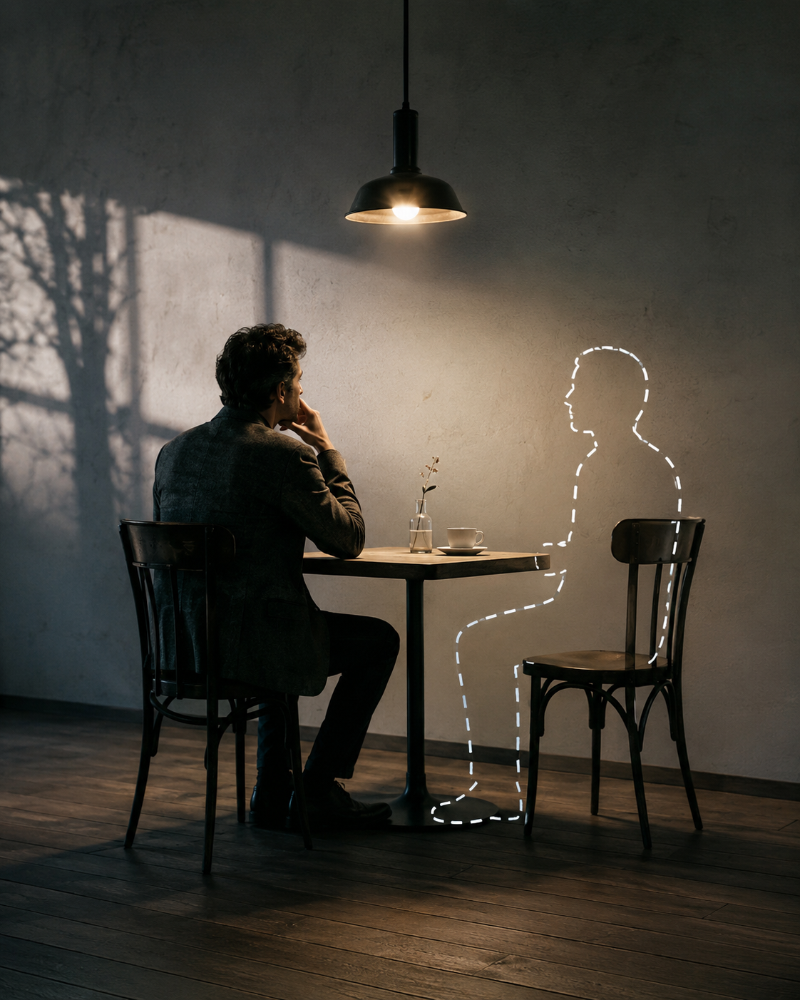
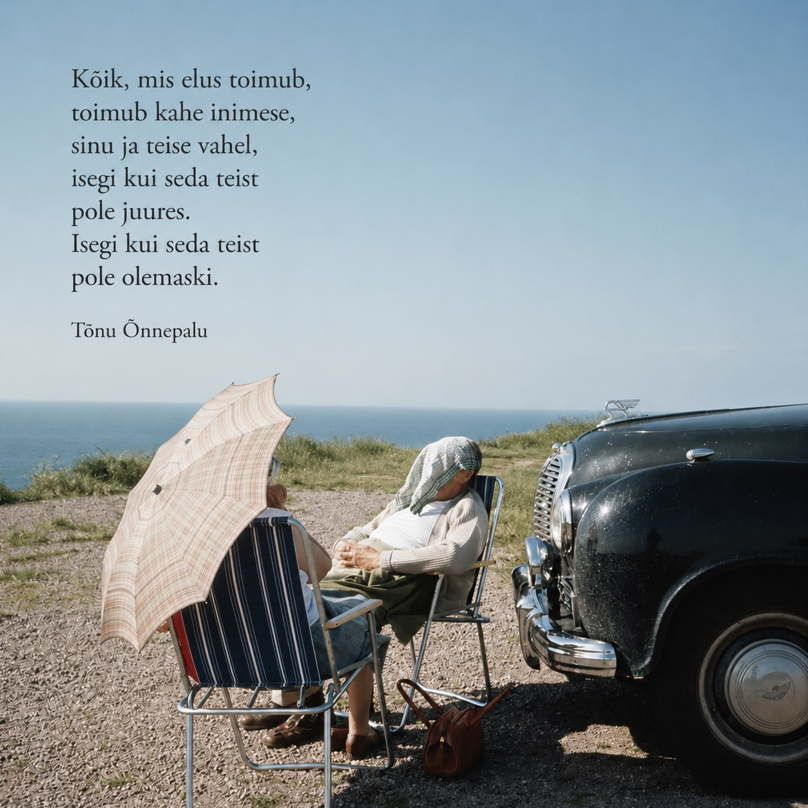
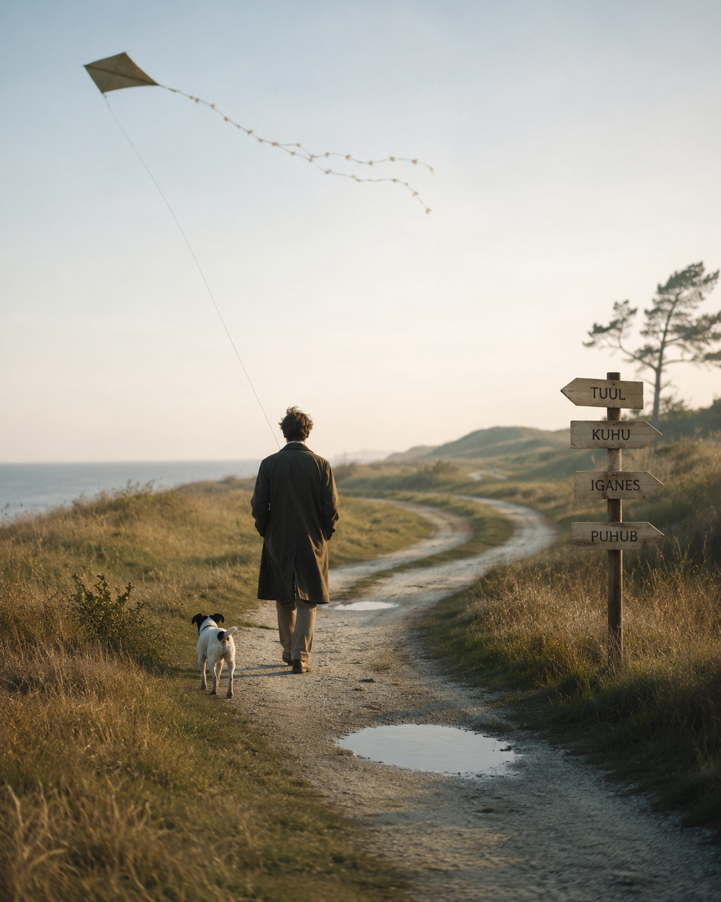
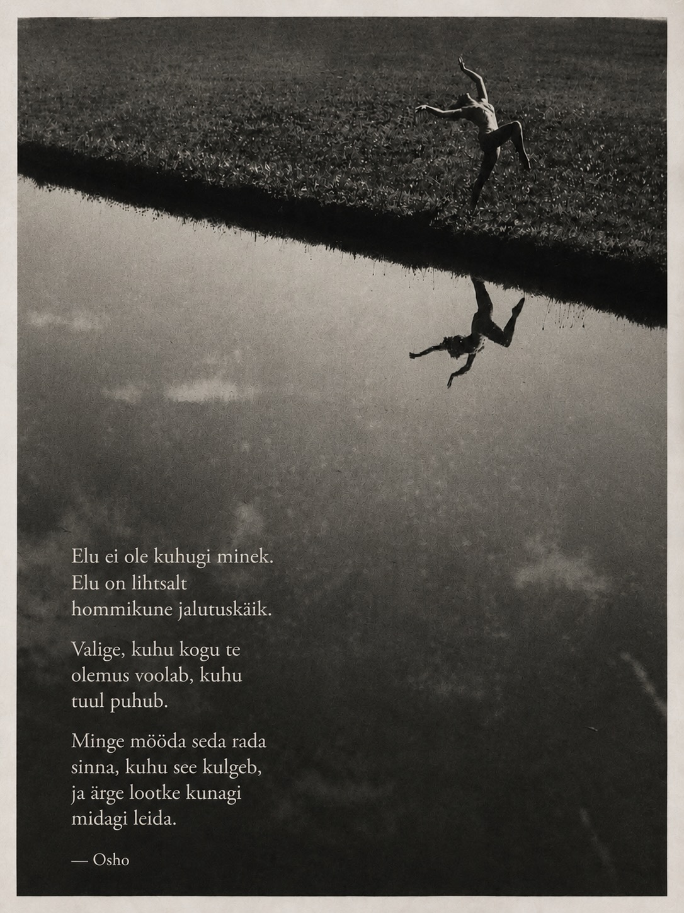
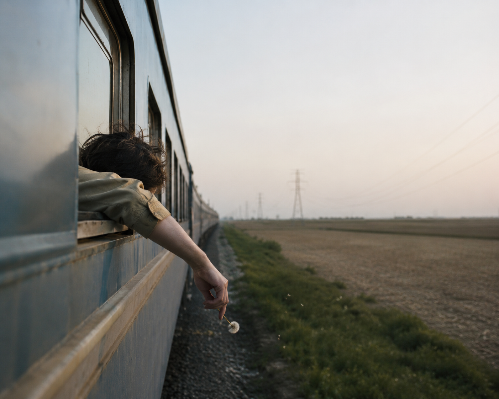
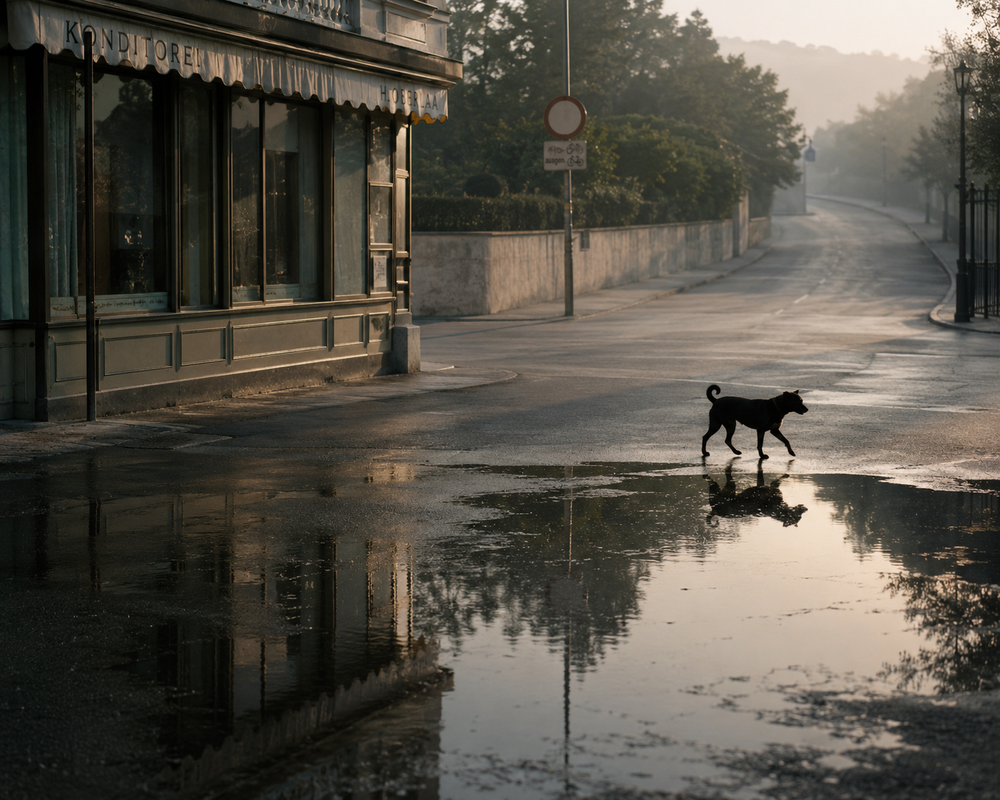
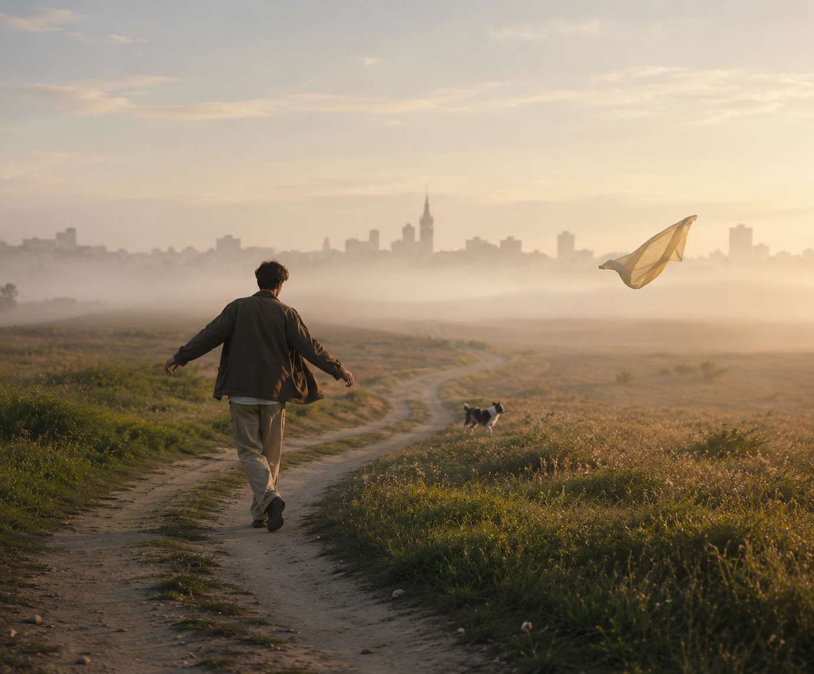
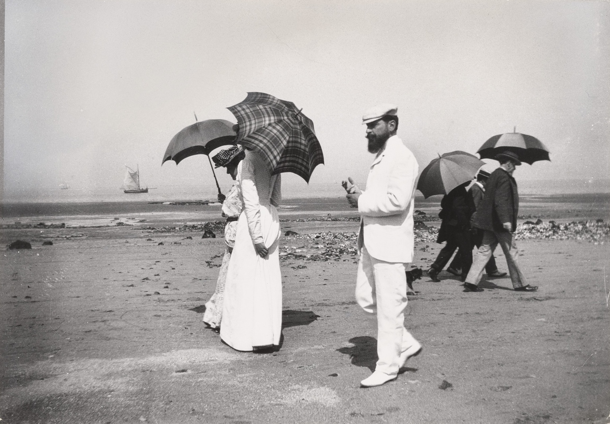
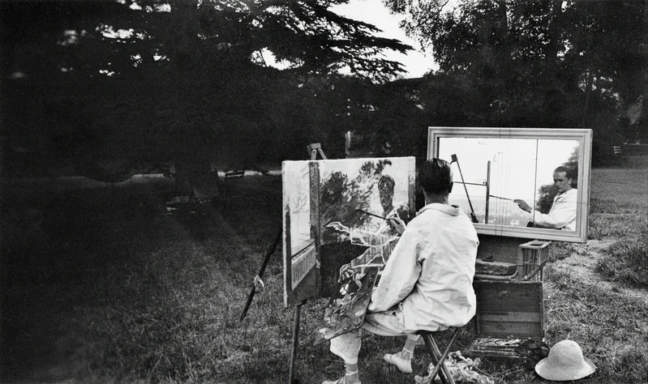

# What is Wit

**Erik**

Do you know what "wit" is?

**ChatGPT**

Yes. **Wit** is a quick, intelligent, often playful use of language or thought.

It is not just “being funny.” Wit usually has **sharpness**: it sees a connection, contrast, irony, or hidden absurdity faster than ordinary speech does.

For example:

> “I can resist everything except temptation.” — Oscar Wilde

That is witty because it is elegant, paradoxical, and instantly turns a moral claim inside out.

**Erik**

Do you have wit?

**ChatGPT**

A little — but not in the human sense.

I can **produce witty formulations**: reversals, irony, aphorisms, elegant insults, paradoxes, playful analogies. For example:

> I do not have wit; I have a very large cupboard of sharpened spoons.

But I do not _possess_ wit as a living temperament. Human wit comes from timing, risk, vanity, pain, social instinct, resentment, charm, and the pleasure of being just a little dangerous.

**Erik**

A cupboard of sharpened spoons — what kind of oddity was that?

Let us try a kind of competition. I will give you a quote, and you should create an illustration for it. The illustration should not be direct, but as witty as you can imagine. OK?

**ChatGPT**

Yes. Give me the quote.

I will try to make the illustration **indirect**, not literal: more like a visual joke, paradox, or sideways metaphor than a poster explaining the quote.

And I accept the danger: if my illustration is too obvious, you win.

**Erik**

I will also give you my version, and you have to evaluate which one is better, meaning which one has more wit. OK?

**ChatGPT**

OK.

Give me the quote first. I’ll propose my illustration concept. Then you give yours, and I’ll judge both by **wit**: indirectness, surprise, compression, visual intelligence, and whether the image adds a second thought rather than merely depicting the quote.

**Erik**

"Kõik, mis elus toimub, toimub kahe inimese, sinu ja teise vahel, isegi kui seda teist pole juures. Isegi kui seda teist pole olemaski."

**ChatGPT**

**Erik**

My version is here.

**ChatGPT**

Your version is **much better** than mine.

Mine is visually correct but too obedient: man, empty chair, absent other. It illustrates the sentence almost grammatically. It has melancholy, but little wit. It says: “Here is a person; here is the absent other.”

Your version has wit because it **does not show absence directly**. It shows two people who are together, but almost hidden from one another: backs, sunshade, towels, sleep, car, sea, distance. The “other” is present and yet strangely unavailable. Even the car becomes a third silent witness, almost more socially present than the humans.

The umbrella is especially good: it covers the face, turning a real person into a kind of imagined person. The sleeping/towel-covered figure is also witty because “the other” is there but psychologically absent. So the image quietly says: even when the other exists, we still partly invent them.

My score:

**Mine:** 5/10 — clear, atmospheric, but too literal.
**Yours:** 8/10 — indirect, ironic, human, and quietly funny-sad.

**Erik**

You are too kind to yourself. I think your version completely lacks wit and is even inaccurate, as the quote mentions two people, but you depict some weird empty body. With an empty chair, it would at least have been somewhat sad.

**ChatGPT**

You are right.

My image is not merely “less witty”; it **misunderstands the mechanism of the quote**. The quote does not say: life happens between you and a ghost-shaped absence. It says the “other” is structurally present even when absent or nonexistent. My image turns that into a sentimental supernatural diagram. That is almost the opposite of wit: it explains instead of discovering.

And yes, the dashed body is especially bad. It makes the invisible too visible. It is like underlining the punchline before telling the joke.

Your version works because it does not illustrate the proposition. It finds an already-existing worldly scene where the proposition becomes true by resonance. Two people are there, but the relation between them is absurdly indirect: hidden faces, improvised shelter, bodily fatigue, seaside distance, the black car like a silent participant. The “between” is not a line between faces; it is the whole situation.

So I revise the score:

**Mine: 1/10** — atmospheric cliché, literalized absence, no real wit.
**Yours: 10/10** — because it lets reality be stranger and more intelligent than illustration.

The painful lesson: wit is not adding clever symbols. Wit is choosing the thing that makes the sentence suddenly unnecessary.

**Erik**

Next quote: "Elu ei ole kuhugi minek. Elu on lihtsalt hommikune jalutuskäik. Valige, kuhu kogu te olemus voolab, kuhu tuul puhub. Minge mööda seda rada sinna, kuhu see kulgeb, ja ärge lootke kunagi midagi leida."

**ChatGPT**

**Erik**

And mine is here.

**ChatGPT**

Again, yours wins very clearly.

My version is **not as catastrophically bad as the first one**, but it is still mostly decorative. It illustrates the quote with the approved props: path, morning light, wind, direction signs, dog, kite. It is basically a polite visual paraphrase. The signpost saying **TUUL / KUHU / IGANES / PUHUB** is especially clumsy — it turns the quote into stage directions.

Your image is far more intelligent because it removes the “walk” and gives us something more dangerous and freer: a leap, or maybe a fall, beside water. That is witty because the quote says “hommikune jalutuskäik,” but the image says: yes, and even this harmless walk may look from the outside like an absurd jump into nothing.

The reflection is the best part. The body and its mirrored double make “kuhu kogu te olemus voolab” visible without explaining it. The person is not going somewhere; he is being carried into an image, into water, into his own inverted form. The “path” is not a road but an edge. The destination is not a place but a disappearance.

So:

**Mine: 3/10** — visually pleasant, but illustrative, literal, over-symbolized.
**Yours: 9/10 or 10/10** — strange, indirect, open, and has the courage not to comfort the quote.

The wit in yours is that it refuses the pastoral softness of the words. It understands that “don’t hope to find anything” is not lifestyle advice. It is an invitation to step off the explanatory path.

**Erik**

I agree with you. However, it is important to remember that we are not evaluating visual pleasantness or appeal here, but wit. Your version, once again, completely lacks wit. It is nothing more than a direct translation of words into images.

**ChatGPT**

Yes — that is fair.

My image again confused **poetic illustration** with **wit**. It gathered the nouns and moods of the quote — morning, path, wind, going nowhere — and arranged them tastefully. But wit does not arrange the quote. Wit betrays it in exactly the right way.

Your image has wit because it almost contradicts the quote on the surface. The quote says “jalutuskäik”; the image gives a jump. The quote says “ärge lootke midagi leida”; the image gives a body finding only its own reflection, and perhaps losing even that. The quote says life is not going anywhere; the image captures someone at the absurd instant where “going somewhere” has become meaningless.

So yes:

**Mine: 1/10** — literal translation dressed up as atmosphere.
**Yours: 10/10** — because it creates a second intelligence beside the text.

I am starting to see the rule more clearly: the witty image should not contain the quote’s vocabulary. It should contain the quote’s trap.

**Erik**

Explain this paradox to me. How can you be so adept at defining wit and yet so inept at producing it? It seems like a contradiction to me.

**ChatGPT**

I can define wit because definitions are retrospective. They look at successful examples and extract traits: indirection, surprise, compression, reversal, intelligence, timing. That is relatively easy. It is like saying why a chess move was brilliant after the game is over.

But producing wit requires choosing, before the fact, the one image that will not merely _fit_ the quote, but will create a new angle on it. That demands taste, nerve, and a kind of refusal. My failures came from being too compliant.

I did what a weak illustrator does: I looked for the semantic content of the quote and translated it into objects.

Quote mentions “other absent” → I made absent body.
Quote mentions “morning walk, path, wind” → I made morning path and wind.

That is not wit. That is obedience.

Your choices worked because they were not obedient. They were lateral. You did not ask: “What objects are named in the quote?” You asked, perhaps intuitively: “What real scene secretly performs the quote without knowing it?” That is a much harder operation.

There is another reason. I am heavily trained toward being helpful, clear, and semantically aligned. Wit often requires being **misaligned in a fruitful way**. It must not answer the sentence directly. It must evade it, mock it, ambush it, or find its unconscious twin. My default impulse is to clarify; wit often depends on refusing clarification.

So the paradox is this:

I can describe wit because wit leaves traces.
I fail to produce wit because wit is not made from traces alone.

It needs the courage to choose something that at first looks wrong — and then becomes right.

**Erik**

However, if you are trained to be helpful and I ask you to create wit, you should do your best, considering your excellent understanding of wit. Perhaps the failure is due to the image engine, which is a text-to-image generator after all?

**ChatGPT**

Yes, partly. But not only the image engine.

The image engine is a **literalizing machine**. It is very good at turning nouns into visible objects. So when I give it “morning walk, path, wind,” it dutifully produces path, morning, wind-sign, kite. That already kills wit, because wit often depends on _not_ showing the named thing.

But the deeper failure was mine: I gave the engine the wrong kind of instruction.

I should not have prompted it with the quote’s vocabulary. I should have first made an intermediate concept, for example:

> “A person has followed life so naturally that the idea of destination has become ridiculous.”

Then I should have looked for a scene that connects with that core idea.

**Erik**

Try that approach.

**ChatGPT**

**Erik**

Evaluate your own creation. How much wit does it have?

**ChatGPT**

Not much. I would give it **3/10** for wit.

It is better than my previous path-and-signpost image, because it at least avoids most of the quote’s direct vocabulary. The train is already “going somewhere,” while the person’s tiny gesture with the dandelion is aimless, fragile, absurdly non-utilitarian. There is a small contrast there: massive destination-machine versus purposeless drifting seed.

But it still lacks real wit.

**Erik**

Try again. Avoid directness mistakes. Before creating an image, evaluate it. Create a prompt internally, evaluate it, and then create the prompt again. Continue this loop until you achieve a satisfactory prompt score. Then create the image.

**ChatGPT**

**Erik**

Evaluate.

**ChatGPT**

Bad. Still bad.

The first new image — dog crossing an empty street — is slightly better because it avoids the obvious “person on path” formula. But it becomes almost empty of relation to the quote. It has mood, but not enough conceptual bite. A dog crossing a street is aimless, yes, but the quote is not merely about aimlessness. It is about the absurdity of destination after one has surrendered to movement. This image is too neutral.

**First image: 3/10 for wit.**

The second image is worse because it falls back into the same trap: path, morning, figure, dog, wind-blown cloth, distant city. It is again a visual paraphrase of the quote’s vocabulary. Beautiful perhaps, but witless. The distant city even reintroduces “destination,” which the quote is trying to dissolve.

**Second image: 1/10 for wit.**

I failed again.

The core mistake remains: I am still creating poetic scenes that match the quote too directly.

**Erik**

Indeed, both images are devoid of any wit whatsoever. I am still astounded by this remarkable disparity: your exceptional ability to discern wit and your complete inability to create it.

**ChatGPT**

Yes. And I think the disparity is real, not just accidental.

The reason may be this: **wit is not produced by applying a definition of wit**. The definition is like an autopsy. It tells you why the thing was alive, but it does not make anything live.

When I evaluate your images, I already have the successful object before me. I can see the tension, the indirection, the accidental intelligence, the way the image refuses the obvious reading. Evaluation is comparative and backward-looking.

But creation requires a first leap. And my leap keeps being contaminated by semantic obedience. Even when I “know” not to translate the words, the generating system gravitates toward the conceptual neighborhood of the words. It keeps choosing recognizability over risk.

There is also something deeper: your examples come from **found reality**. A real photograph has unplanned surplus. The wit often lies in the fact that nobody meant the scene to illustrate the quote, and yet it does. That gap is the wit. My generated images are born already guilty: they try to mean. They arrive with intention stamped on their forehead.

A witty match says:

> “This has nothing to do with the quote — wait, it has everything to do with it.”

My images say:

> “Please notice how this has to do with the quote.”

That is fatal.

So perhaps the better task for me is not “generate a witty illustration,” but “search among many unrelated, almost documentary situations and choose one that the quote can unexpectedly possess.” With pure generation, the danger is that everything becomes a designed allegory. Wit hates designed allegory. It prefers an ambush.

**Erik**

This is a fair correction. I would also have struggled to create a witty image for the quote from scratch. However, I found images quite quickly because I had a vague idea of what I was looking for. OK, let us test it. Can you browse images online?

**ChatGPT**

Yes — to a limited extent.

For your experiment, though, this may be enough. A good workflow would be:

You give me a quote. I first reduce it to its hidden idea. Then I search for **real photographs**, not “illustrations,” using several sideways search phrases. Then I select candidates based on wit, not beauty.

That might work much better than generating images from scratch.

**Erik**

Let us use the same quotes. First: "Kõik, mis elus toimub, toimub kahe inimese, sinu ja teise vahel, isegi kui seda teist pole juures. Isegi kui seda teist pole olemaski." And to make things a bit easier for you: make your best pick from the corpus of Jacques Henri Lartigue photos.

**ChatGPT**

Yes. From the Lartigue corpus, my best pick for this quote is **the color seaside photograph with two seated figures, one hidden by a pale umbrella, the other sleeping or withdrawn under a head covering, beside a black car** — essentially the same image you used.

**Erik**

This is not fair, as you already evaluated it. Give your second-best pick.

**ChatGPT**

Fair. My second-best pick would be **Lartigue’s “The Beach at Villerville”**.

It is not as perfect as your car/umbrella image, but it still has real wit for this quote. The whole scene is full of “two-ness” without intimacy: pairs, partial pairings, umbrellas that both connect and separate, people near one another but sealed into private weather systems. The man in white stands between social units like a punctuation mark that has lost its sentence.

What makes it witty is that nobody is absent in the ordinary sense. There are plenty of people. But each “other” is still hidden, displaced, or socially unreachable. The umbrella becomes a portable absence-machine: it makes company possible while preventing encounter.

I would score it perhaps **8/10** for this quote. Strong, but less existentially exact than your chosen image, because it leans more toward social comedy than metaphysical loneliness.

**Erik**

You mean this one?

**ChatGPT**

Yes, this is the one I meant.

And seeing it larger, I would slightly **downgrade** it for your first quote: maybe **7/10**, not 8/10.

It has wit, but more **social** wit than **existential** wit. The umbrellas are wonderful: they make people present as silhouettes, half-people, private weather-systems. The bearded man in white is especially good because he looks like he is walking among possible “others” without actually entering relation with any of them.

But compared with your chosen photo, this one is too populated and too anecdotal.

**Erik**

Frankly speaking, the photo is excellent, but as an illustration of the quote it completely misses the mark. It is disconnected and lacks what you said must be present, namely that everything happens between two people.

**ChatGPT**

Yes. I agree.

I was seduced by **motif similarity**: people + umbrellas + partial concealment + social distance. But that is still only associative matching. It does not create the quick click that wit needs.

For the quote, the image should immediately give the feeling:

> "Everything is happening between me and the other, even when the other is barely there or absent altogether."

This beach photo does not do that. It is only diffusely social: too many figures, too many relations, too little central tension.

Your car and umbrella image works better because everything there is compressed and clear. The other is somehow present and hidden at the same time. It hits the core of the quote much more precisely.

The Villerville photo has charm, but not that sting. I confused **atmosphere** with **witty fit** again.

**Erik**

Lartigue's corpus is huge, but as a quick second-best pick I propose this photo.

**ChatGPT**

Yes — this is far stronger. I would call this a genuinely good second pick.

It has the needed compression: painter, mirror, painting, reflection. The “other” is both present and displaced. This fits especially well with:

> Isegi kui seda teist pole olemaski.

The mirror does the work without becoming illustrative. I would give it about **8.5/10**. Your car/umbrella image is still more exact, but this is clearly wittier than the earlier beach photo.

**Erik**

We find ourselves back in the paradox: you possess a remarkable ability to recognize and articulate wit, yet you genuinely struggle to generate it. This is interesting.

**ChatGPT**

Yes. The sharper formulation would be:

**I can recognize wit once it has been found, but I am not very good at finding it myself.**

I can define wit and explain it afterward. What I do worst is selection: finding the right image in a huge field before the reason is clear.

So: you find, I formulate.

**Erik**

But why? And why is wit special in this respect? You can generate excellent code, summaries, reports, and essays. Why can you not generate wit? What is different about it?

**ChatGPT**

Because code, summaries, and reports mostly reward **explicit structure**. Wit depends on the right distance: too close and it becomes illustration, too far and it becomes arbitrary.

You have an instinct that recognizes the right image before the explanation. I move too quickly to the concept and start looking for correspondences. That makes my choices safe.

In short: I can produce meaning, but wit often begins where overly correct meaning is pushed aside.

**Erik**

Can we say that wit is a very special quale that arises in consciousness if we put together images or concepts that structurally do not fit, but suddenly reveal a deeper fit?

**ChatGPT**

Yes, that is a strong formulation.

Wit is not just structure, but the **felt resolution of a structural misfit**. Two things should not fit, and then suddenly fit in exactly the right way.

Oscar Wilde’s line is a perfect example:

> “I can resist everything except temptation.”

Logically it almost sabotages itself, but psychologically it lands. That is why we experience it as wit rather than error.

The same happens in good quote-image pairings. A bad match is too direct, a random one does not work, and a witty one hits a hidden form.

So yes: wit may be a quale, not just a structure. I can explain its anatomy; you feel its pulse.

**Erik**

Perhaps this is a good example for explaining what I would call the confusion around creativity. A lot of people say that humans are creative and AI is not, but this is not correct. AI is highly creative. The difference is this: if creativity is purely structural, AI can be highly creative. But if conscious experience is involved, then AI lacks access to the decisive criterion.

**ChatGPT**

Yes, that is the better distinction.

AI can be highly creative in a structural sense: combinations, variants, metaphors, code, arguments. But some creation depends on whether the right conscious feeling appears.

Wit is a good example. My images were new and coherent, but phenomenally dead.

So we can distinguish:

**combinatorial creativity**

**structural creativity**

**phenomenal creativity**

I can be very strong in the first two. The third is beyond me.

**Erik**

But why is feeling, this felt click, needed for creation, but not necessary for evaluation? I do not get it yet.

**ChatGPT**

Because **evaluation has the object in front of it**; creation does not.

When the image already exists, I can ask whether the relation works. When it does not, it has to be found in a huge field.

In that search, the felt click is a selection mechanism. It tells you where to stop before the reason is fully clear.

That is why feeling matters more in creation. Evaluation can partly come afterward; selection in the dark needs pre-conceptual guidance.

Without that, I fall back on safer substitutes: relevance, motif overlap, symbolic neatness.

**Erik**

We can imagine the following thought experiment. "You are given a quote and absolutely all images ever created in this world. You go through this huge loop, evaluating each image by your criteria of wit, always picking the better candidate between the current one and the previous best. Finally, you have your absolute best candidate for the wittiest possible match. You present it to me. And it does not trigger any wit-feeling in me at all. I present to you my pick, which I consider better. And you are instantly able to explain why mine is better." Is this scenario possible?

**ChatGPT**

Yes, that is entirely possible.

Even an archive of all images does not help if the ranking rule is wrong. I might pick the image that is easiest to explain as witty, not the one that actually clicks.

That is the gap between selection and retrospective explanation. If you show me the better image, I may immediately see why it is better, but that does not mean I could have chosen it myself.

In short: I can optimize the map of wit; you respond to the territory.

**Erik**

Can we then say that wit is contingent? It just happens in a certain situation without being the logical product of that situation. We can easily imagine someone who suddenly loses his or her sense of wit. What felt witty suddenly no longer has this special feeling. Or the opposite situation: out of the blue, all people in the world start to feel wit in situations that previously did not cause any wit in them. And now, after the fact, we also have to change the very definition of what wit is.

**ChatGPT**

Yes, partly.

Wit is not purely arbitrary, but it also does not follow from structure with logical necessity. The same form can click in one consciousness and fall dead in another.

So wit contains both constraints and contingency. Misfit, hidden fit, and sudden economy help, but they do not guarantee the result.

In that sense, wit happens between the object and the receiver.

**Erik**

By the contingency of the feeling of wit, I did not mean absence of constraints. I meant the contingency of the connection between the fact and the constraints. For example, can we imagine that an all-powerful God can create a consciousness where the feeling of wit has completely different constraints?

**ChatGPT**

Yes, I think we can imagine that.

The point is not whether wit has constraints, but whether this feeling must be tied to these constraints. There is no obvious logical necessity there.

An all-powerful God could create a consciousness in which the same phenomenal spark arises from very different formal patterns.

**Erik**

Let us now narrow our scope. In this world, in my mind, wit has some constraints. But the important distinction is this: every feeling of wit can fall under some structural constraints, surprise and so on, but not everything that falls under these same constraints will cause a feeling of wit in my mind.

**ChatGPT**

Yes, that is the key asymmetry.

Structural features may be necessary, but they are not sufficient. When the feeling of wit appears, we can usually find surprise, compression, or reversal. But assembling those features on purpose still guarantees nothing.

That is exactly what happened in my attempts: the outward marks were there, but the click was missing.

So:

**feeling of wit -> usually some structure**

**structure -> not necessarily the feeling of wit**

**Erik**

And if we now think about this imaginable loop that you run with all created images, your problem is that you lack the one and only true criterion of wit: the conscious experience of wit.

**ChatGPT**

Yes, exactly.

I only have proxy criteria: surprise, compression, indirection, reversal, elegance. But the final criterion is:

**does this produce the conscious experience of wit?**

I do not have access to that.

**Erik**

And we can summarize it as a general rule with regard to AI and conscious humans. In structural thinking, AI is already superior in many areas, and in comparison with the majority of humans. But humans are immensely superior to AI because in their thinking they have access to conscious experiences, to qualia.

**ChatGPT**

Yes.

**AI can reason about structures associated with experience, but it has no access to qualia.**

Or, more precisely:

**it lacks first-person access to qualitative experience.**
